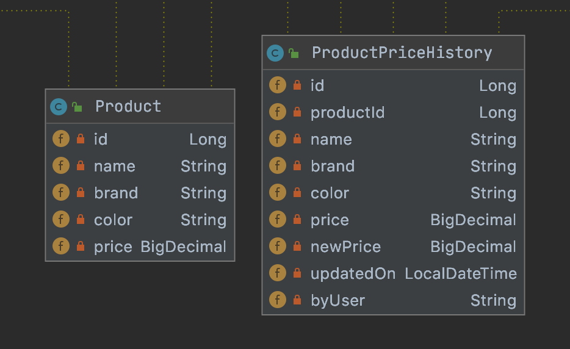
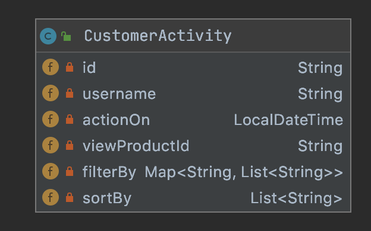
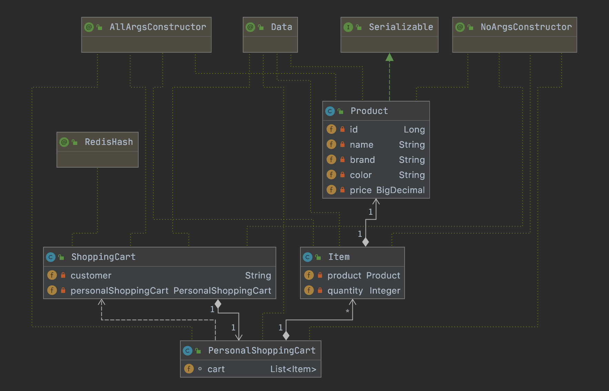
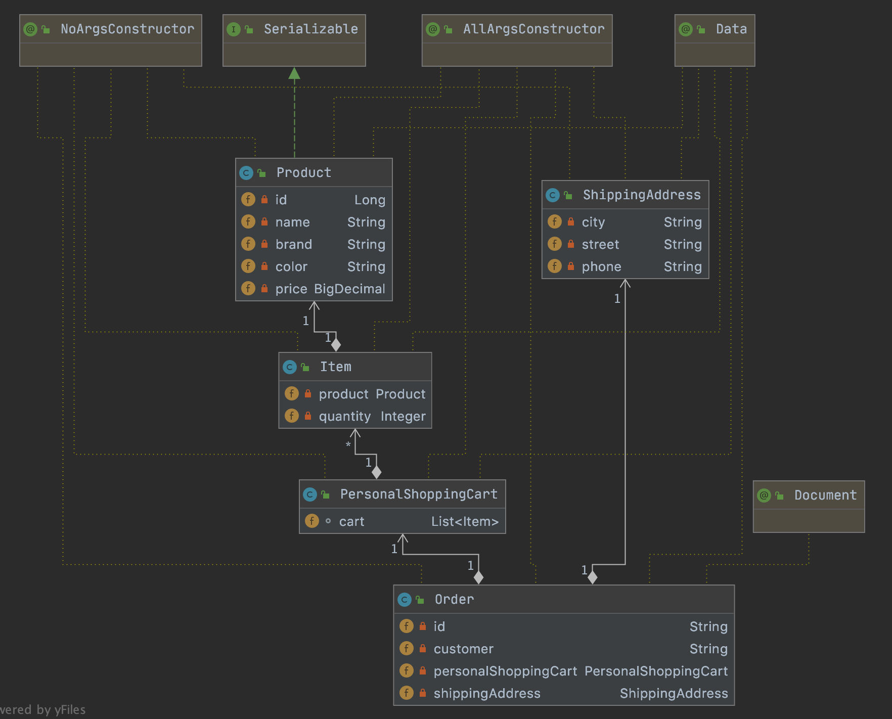

# icommerce
Simple online shopping application to sell products (backend only)
## System Design

### 1. Requirement clarification
A small start-up named "iCommerce" wants to build a very simple online shopping application to sell their products. In order to get to the market quickly, they just want to build an MVP version with a very limited set of functionalities:
a. The application is simply a simple web page that shows all products on which customers can filter, short and search for products based on different criteria such as name, price, brand, colour etc.

b. All product prices are subject to change at any time and the company wants to keep track of it.

c. If a customer finds a product that they like, they can add it to their shopping cart and proceed to place an order.

d. For audit support, all customers' activities such as searching, filtering and viewing product's details need to be stored in the database. However, failure to store customer activity is completely transparent to customer and should have no impact to the activity itself.

e. Customer can login simply by clicking the button “Login with Facebook”. No further account registration is required.

f. No online payment is supported yet. Customer is required to pay by cash when the product got delivered.

### 2. High-level design
At a high-level, we need some following services (or components) to handle above requirements:

- **Product Service**: manages our products with CRUD operations. This service also provides the ability to allow user could filter, sort and search for products based on dynamic criteria.
- **Audit Service**: records all customers activities (filtering, sorting, viewing product detail).
- **Shopping Cart Service**: manages customers shopping carts with CRUD operations.
- **Order Service**: manages customer orders with CRUD operations.
- **Authentication Service**: authenticates customers, integrates with 3rd party identity platform like Facebook, Google...
- **API Gateway**: Route requests to multiple services using a single endpoint. This service allows us to expose multiple services on a single endpoint and route to the appropriate service based on the request.
### 3. Defining data model
In this part, we describes considerations for managing data in our architecture. For each service, we discuss data schema and datastore considerations.

In general, we follow the basic principle of microservices is that each service manages its own data. Two services should not share a data store.

#### Product Service
The Product service stores information about all of our product. The storage requirements for the Product are:
- Long-term storage.
- Read-heavy (it's common for ecommerce application because the traffic from users to view, search, sort product are always much higher than the traffic from administrators to update product's information).
- Structured data: Category, Product, Brand, ProductPriceHistory. 
- Need complex joins (for example, in the UI, maybe we have a menu with different categories, user could choose a category and then view all products in that category, then each product will have many different variants like a T-shirt will have many different sizes and colors).

A relational database is appropriate in our case. For the simplicity of the assignment, we simplify the data schema like this:

#### Audit Service
The Audit service listens for customer activities from the Product service. The storage requirements for the Audit service are:
- Long-term storage.
- Non-relational data.
- Able to handle massive amount a data (read-heavy as we mentioned in Product section above).
- Dynamic or flexible schema.

A document-oriented database is appropriate, and MongoDB is good fit in our scenario. It also supports to store Geolocation data and build-in queries to query data based on location -> it could help us if we want to know something like customers in which city will interest on which products (maybe for Product Recommendation Service).

We define the data schema like this:

#### Shopping Cart Service
The Shopping Cart service stores information about shopping cart of the customers. The storage requirements for the Shopping Cart Service are:
- Short-term storage. Each customer will have their own shopping cart and only one shopping cart at the moment. After customer checkout, the shopping cart data will be cleared.
- Need retrieve/lookup shopping cart data quickly and update shopping cart data quickly (for example, there are some big sale periods in a year like 11/11 and 12/12, a lot of customers come to our system and update their shopping cart data to make the order).
- Support only 1 simple query: query by customer.

The HashMap data structure (with the key is customer and the value is shopping cart data) seems meet our needs because the get and put operations take only constant time. But we will get the problem if the server running Shopping Cart Service goes down (we will lose all the shopping cart data of customers) or if we run many instances of Shopping Cart Service (we need to sync data between these instances). Redis could solve these problem easily and meets all our needs with its Hash Table high read-write performance with schema like this.

| Key (Customer) | Value (Shopping Cart data)       |
|--------------- |:--------------------------------:|
| Username       | List of Product and its quantity |
        

        
#### Order Service
The Order service stores information about all of our customer orders. The storage requirements for the Order are:
- Long-term storage.
- Able to handle a high volume of packages, requiring high write throughput (for example, there are some big sale periods in a year like 11/11 and 12/12, a lot of customers come to our system and make orders).
- Support simple queries. No complex joins or requirements for referential integrity.

Because the order data is simple and not relational, a document-oriented database is appropriate, and MongoDB can achieve high throughput and scale well in terms of volume of traffic or size of data (or both).

### 4. Detailed design

#### Authentication Service
To simplify the setup, here we use [Okta](https://www.okta.com/products/customer-identity/authentication/) - an Identity Cloud Service, and it provides us some benefits:
- Single point to authenticate our customers: simplify our downstream microservice, these services just need to verify/validate the access token of users.
- Store data about our customer: In ecommerce application, we will need these data to send marketing/promotion emails...
- Perform almost popular social logins: Now we need support "Login with Facebook" only, but in the future maybe we need Google, LinkedIn...And we don't want to update all our downstream microservices to support more social logins. To simplify the process, we don't config Okta use Facebook Social Login, we login by username/password instead.
In the case we don't want to use cloud service, we could use Keycloak - an open source identity solution provides the same capacities.
#### API Gateway
We need API Gateway for following reasons:
- When a client needs to consume multiple services, setting up a separate endpoint for each service and having the client manage each endpoint can be challenging. Each service has a different API that the client must interact with, and the client must know about each endpoint in order to connect to the services. If an API changes, the client must be updated as well. If we refactor a service into two or more separate services, the code must change in both the service and the client.
- Simplify application development by moving shared service functionality, such as the use of SSL certificates, from other parts of the application into the gateway. Other common services such as authentication, authorization, logging, monitoring, or throttling can be difficult to implement and manage across a large number of deployments. It may be better to consolidate this type of functionality, in order to reduce overhead and the chance of errors. Simpler configuration results in easier management and scalability and makes service upgrades simpler.

- Provide some consistency for request and response logging and monitoring.
#### Registry Service
#### Product Service
#### Audit Service
#### Shopping Cart Service
#### Order Service
### 5. Identifying and resolving bottlenecks
